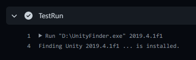

# Unity-Finder

Returns 0 if the specified version of Unity is installed, or 1 otherwise.  
Intended for use in CI.

## Usage

`UnityFinder 2019.4.20f1`

## Prerequisite

[Unity Hub](https://unity3d.com/get-unity/download) 2.1.0 or above.

